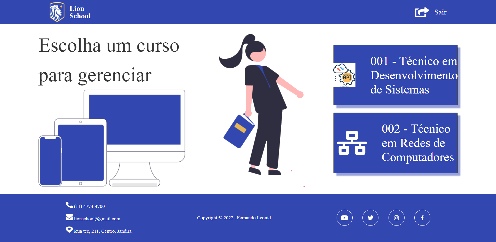

# 
Atividade integrada - SENAI 2023

   
   <h1>-SUMÁRIO</h1>

-  [TO DO LIST](#to-do-list)
-  [TECNOLOGIAS APLICADAS](#tecnologias-aplicadas)
-  [FERRAMENTAS](#ferramentas)
-  [COLABORADORES](#colaboradores)
   

  
   <h1>-SOBRE</h1>   

A atividade tem como objetivo integrar as disciplinas de PWFE (Programação web Front-end) e PWBE (Programação web Back-end) do curso de desenvolvimento de sistemas do SENAI Jandira.
O projeto é o gerenciamento da escola Lion School, deverá ser realizado tanto o back-end como o front-end.

   
   <h1>TO DO LIST:</h1>   

- [ ] Criou layout conforme designer feito no Figma?
- [] Os botões dos cursos são dinâmicos?
- [] Os cards são criados dinamicamente?
- [] A página com informações dos cursos foi criada dinamicamente?
- [] O filtro por status está funcional?
- [ ] Os nomes das variáveis, funções e arquivos tem valor semântico?
- [] A maioria das funções seguem as boas práticas como responsabilidade única?
- [] Foi criado o layout responsivo no Figma?
- [] Foi implementado a responsividade conforme planejado no Figma?
- [] Foi criado o filtro por ano?

   <h1>TECNOLOGIAS APLICADAS</h1>   

- HTML5
- CSS3
- javaScript

<h1>FERRAMENTAS</h1> 
       

   
   <h1>COLABORADORES</h1>   

| NOMES                                                                                                                                                                                      |                                               GITHUB                                               |                                                                              |
| :----------------------------------------------------------------------------------------------------------------------------------------------------------------------------------------- | :------------------------------------------------------------------------------------------------: | :-------------------------------------------------------------------------------: |
|
  |    
|
|   |  | |